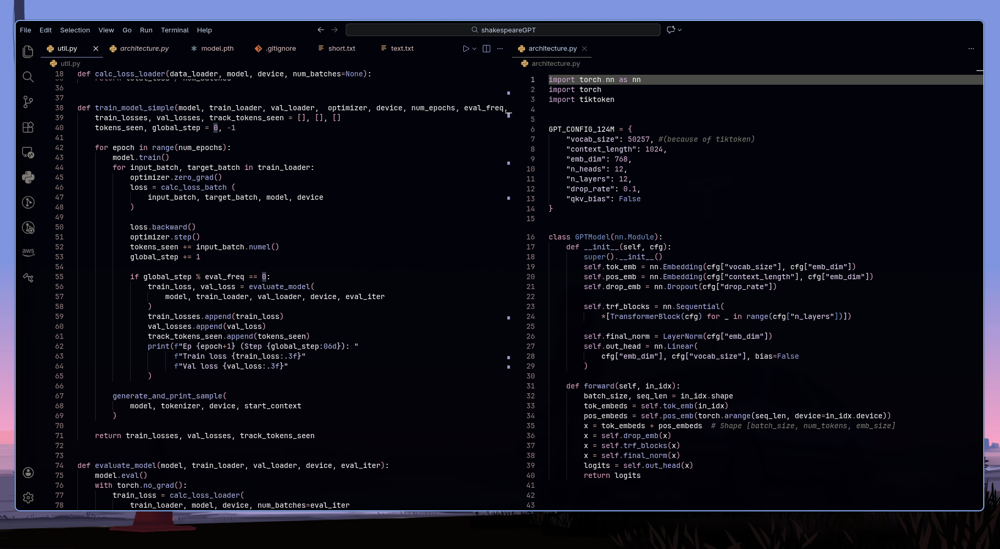
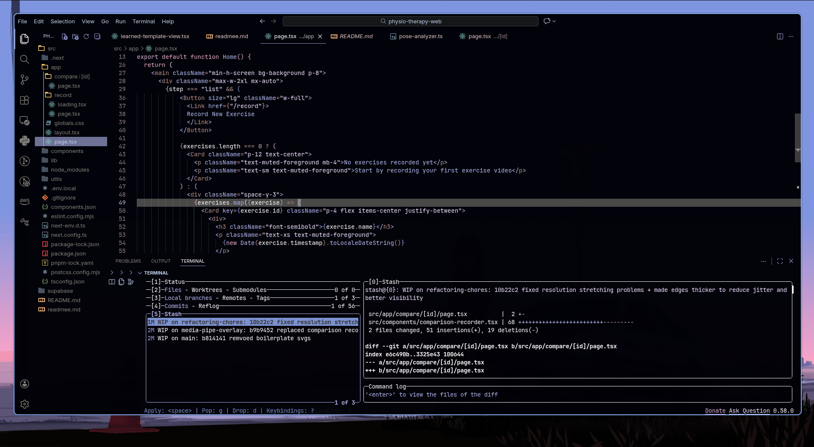

.jpg)

# Ghost Pastel

A dark, low-noise Visual Studio Code theme built around soft pastels and a fully unified background.  
The goal is visual calm and ofcourse Aesthetics

---

---
## Installation
- Press `Ctrl+P` on your VSCode
- Run `ext install rokage.ghost-pastel`
---

---

